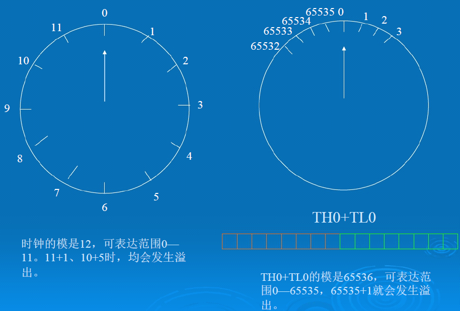
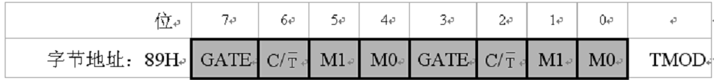
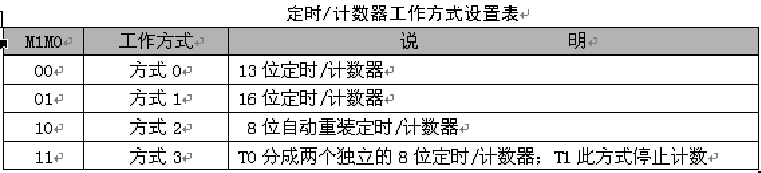
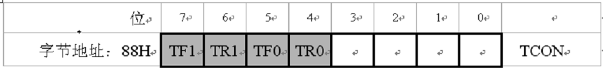
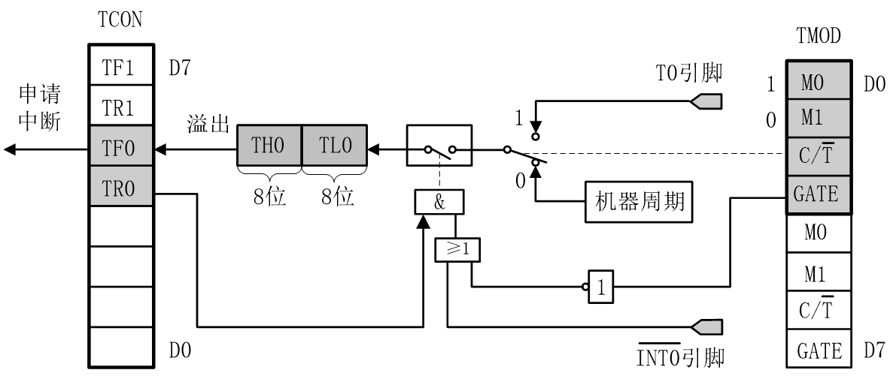
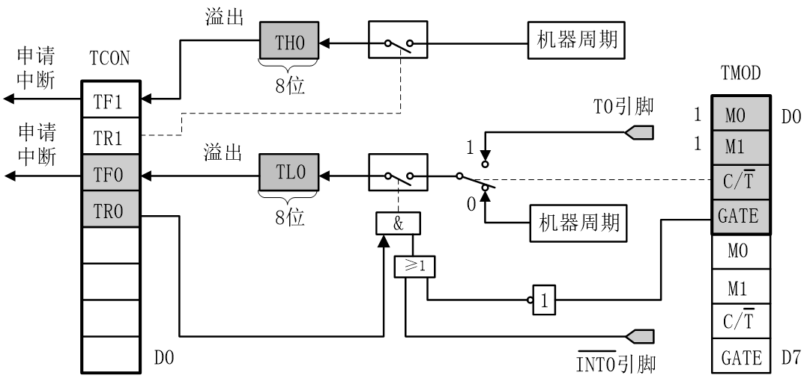
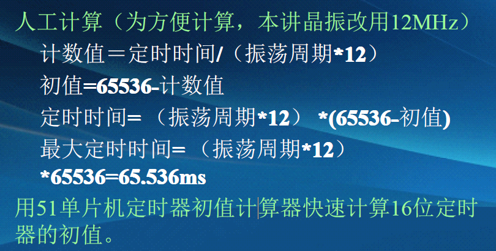

# 单片机定时器


## 定时器操作步骤(置顶)：
1. 选择工作方式（设置M1，M0）
2. 选择控制方式（设置GATE）
3. 选择定时器还是计数器模式（设置C/T）
4. 给定时/计数器赋初值(设置THx和TLx)
5. 开启定时器中断（设置ET0或ET1）
6. 开启总中断（设置EA）
7. 打开计数器（设置TR1或TR0）  

_看上去很麻烦是吗，但其实用的熟一点就好了，用一个configuration的函数配置，慢慢的就熟悉了_
```
/*******************************************************************************
* 函数名       : TimerConfiguration()
* 函数功能   : 配置定时器值
* 输入           : 无
* 输出           : 无
*******************************************************************************/		   

void TimerConfiguration()
{
    TMOD = 0x01; //定时器0选择工作方式1
    TH0 = 0x3C;	 //设置初始值
    TL0 = 0x0B0; 
    EA = 1;			 //打开总中断
    ET0 = 1;		 //打开定时器0中断
    TR0 = 1;		 //启动定时器0
}

```

## 从软件延时的缺点说起
前面讲过的“用若干次空循环实现延时”  生活中的例子。。  
软件延时的缺点：  
- 延时过程中，CPU时间被占用,无法进行其他任务，导致系统效率降低。  
- 延时时间越长，该缺点便越明显，因此软件延时只适用于短暂延时，或简单项目。
## 定时/计数器
单片机中有多个小闹钟，可以帮助我们实现延时，这些小闹钟就是“定时器”。  
本讲只讲T0，每个定时/计数器既可以实现定时功能，也可以实现计数功能，本讲只讲定时功能。
T0可以工作在4种定时器模式下。

## 定时/计数器0的工作原理
在定时方式1下，定时/计数器0的核心是一个16位宽的由计数脉冲触发的按递增规律（即累加方式）工作的循环累加计数器（TH0+TL0）。  
从预先设定的初始值开始，每来一个计数脉冲就加1，当加到计数器为全1时，再输入一个脉冲，就会发生溢出现象，计数器回零，同时产生溢出中断请求信号（TF0置1）。  
_如果定时/计数器工作于定时模式，则表示定时时间已到。_
## 80C51的定时/计数器
实现定时功能，比较方便的办法是利用单片机内部的定时/计数器。也可以采用下面三种方法：  
- 软件定时：软件定时不占用硬件资源，但占用了CPU时间，降低了CPU的利用率。
- 采用时基电路定时：例如采用555电路，外接必要的元器件（电阻和电容），即可构成硬件定时电路。但在硬件连接好以后，定时值与定时范围不能由软件进行控制和修改，即不可编程。
- 采用可编程芯片定时：这种定时芯片的定时值及定时范围很容易用软件来确定和修改，此种芯片定时功能强，使用灵活。在单片机的定时/计数器不够用时，可以考虑进行扩展。

## 定时器溢出
__什么是溢出？__  
任何一个计数范围有限的系统，均存在溢出现象。系统的可表达数的个数，称为模。定时器溢出时会导致定时器溢出中断请求，和该中断是否使能无关。  
  
## 定时器/计数器的结构及工作原理
 
## 定时/计数器的结构和工作原理
### 一、定时/计数器的结构
定时/计数器的实质是加1计数器（16位），由高8位和低8位两个寄存器组成。  
TMOD是定时/计数器的工作方式寄存器，确定工作方式和功能；TCON是控制寄存器，控制T0、T1的启动和停止及设置溢出标志。
### 二、定时/计数器的工作原理
加1计数器输入的计数脉冲有两个来源,一个是由系统的时钟振荡器输出脉冲经12分频后送来；一个是T0或T1引脚输入的外部脉冲源。  

每来一个脉冲计数器加1，当加到计数器为全1时，再输入一个脉冲就使计数器回零，且计数器的溢出使TCON中TF0或TF1置1，向CPU发出中断请求（定时/计数器中断允许时）。  

如果定时/计数器工作于定时模式，则表示定时时间已到；如果工作于计数模式，则表示计数值已满。可见，由溢出时计数器的值减去计数初值才是加1计数器的计数值。

设置为定时器模式时，加1计数器是对内部机器周期计数（1个机器周期等于12个振荡周期，即计数频率为晶振频率的1/12）。计数值N乘以机器周期Tcy就是定时时间t 。  

设置为计数器模式时，外部事件计数脉冲由T0或T1引脚输入到计数器。在每个机器周期的S5P2期间采样T0、T1引脚电平。当某周期采样到一高电平输入，而下一周期又采样到一低电平时，则计数器加1，更新的计数值在下一个机器周期的S3P1期间装入计数器。  

由于检测一个从1到0的下降沿需要2个机器周期，因此要求被采样的电平至少要维持一个机器周期。当晶振频率为12MHz时，最高计数频率不超过1/2MHz，即计数脉冲的周期要大于2 μs。


## 定时/计数器的控制
80C51单片机定时/计数器的工作由两个特殊功能寄存器控制。TMOD用于设置其工作方式；TCON用于控制其启动和中断申请。

### 工作方式寄存器TMOD
工作方式寄存器TMOD用于设置定时/计数器的工作方式，低四位用于T0，高四位用于T1。其格式如下：  
 

GATE：门控位。
- GATE＝0时，只要用软件使TCON中的TR0或TR1为1，就可以启动定时/计数器工作；  
- GATA＝1时，要用软件使TR0或TR1为1，同时外部中断引脚或也为高电平时，才能启动定时/计数器工作。即此时定时器的启动多了一条件。  

C/T :
 - 定时/计数模式选择位。
    - C/T ＝0为定时模式； 
    - C/T =1为计数模式。  

M1M0：
 - 工作方式设置位。定时/计数器有四种工作方式，由M1M0进行设置。
   
### 控制寄存器TCON
TCON的低4位用于控制外部中断,已在前面介绍。TCON的高4位用于控制定时/计数器的启动和中断申请。其格式如下：  
   
- TF1（TCON.7）：T1溢出中断请求标志位。T1计数溢出时由硬件自动置TF1为1。CPU响应中断后TF1由硬件自动清0。T1工作时，CPU可随时查询TF1的状态。所以，TF1可用作查询测试的标志。TF1也可以用软件置1或清0，同硬件置1或清0的效果一样。
- TR1（TCON.6）：T1运行控制位。TR1置1时，T1开始工作；TR1置0时，T1停止工作。TR1由软件置1或清0。所以，用软件可控制定时/计数器的启动与停止。
- TF0（TCON.5）：T0溢出中断请求标志位，其功能与TF1同。
- TR0（TCON.4）：T0运行控制位，其功能与TR1类同。
## 定时/计数器的工作方式
1. 方式0  
方式0为13位计数，由TL0的低5位（高3位未用）和TH0的8位组成。  
TL0的低5位溢出时向TH0进位，TH0溢出时，置位TCON中的TF0标志，向CPU发出中断请求。  

2. 方式1   
方式1的计数位数是16位，由TL0作为低8位、TH0作为高8位，组成了16位加1计数器 。  

3. 方式2 
方式2为自动重装初值的8位计数方式。 
    
计数个数与计数初值的关系为：
__X=2^8-N__
4. 方式3 
方式3只适用于定时/计数器T0，定时器T1处于方式3时相当于TR1=0，停止计数。   
   
__工作方式3将T0分成为两个独立的8位计数器TL0和TH0 。__

## 定时器0初值计算
   
## 定时/计数器的作用
1. 进行延时。
2. 对外部信号的时间间隔进行精确测量。
3. 对外部脉冲信号进行计数。
