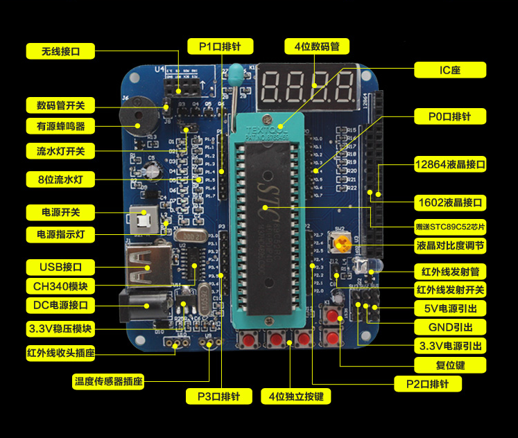
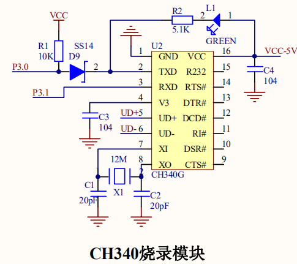
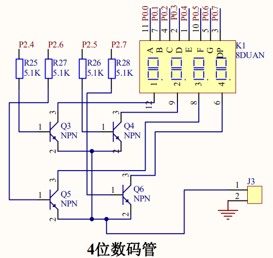
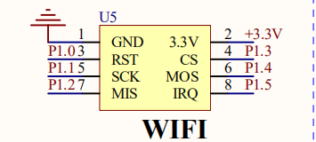
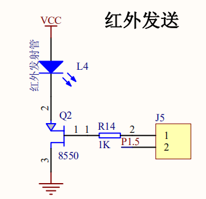

# 了解开发板

## 2.1.项目分析
在使用开发板之前，必须熟悉各个模块的电路图和功能,如下图  

## 2.2 技术准备
### 2.2.1 亚博BST-M51模块电路图
#### 1.CH340烧录模块电路  
  
如图所示,ch340烧录模块电路如上图所示，其中:  
* VCC-5V为USB的5V电源
* VCC为木块供电点
* TXD为串行数据输出
* RXD为行数据输入
* GND为模块接地  
#### 2. 4位数码显示电路  
  
4位数码显示电路如图所示，每一位由a ~ g7段发光二极管LED组成。高电平发光，不同亮暗就能显示不同的数字。  
#### 3.wifi模块
  
如图，该模块由5V或3.3V电源供电，工作温度范围为-45~85°C。尺寸为32x20x4.5mm。
#### 4.通用红外模块
通用红外遥控系统由发射和接收两大部分组成，如图。  
  
应用编码解码由专用集成电路芯片操控。发射部分包括键盘、编码调制、LED红外发射器；接受部分包括光电转换放大器、解调、解码电路。
