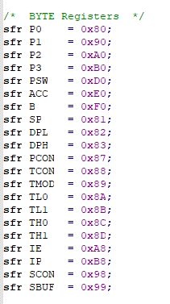
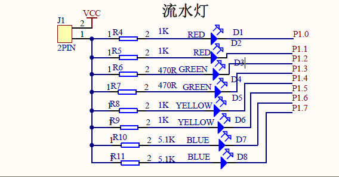
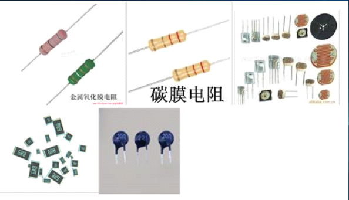
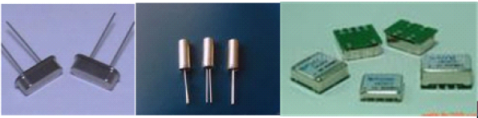

# 点亮一个LED灯  
## 本实验主要学习以下内容：  
1. 发光二极管介绍，硬件介绍。  
2. 如何建立工程、完成“点亮一个发光管”、程序的编写、编译  
3. 进行程序烧写  

## 学习目标：  
__学会用C语言控制单机，点亮开发板上的第1个LED发光管__  
```
/*****************************************
*实验效果 ：程序烧录进去后 第一个LED灯被点亮
sfr P1    = 0x90;//1001 0000
8位控制8个led非常合理，低电平是on！！

******************************************/
#include<reg52.h>
//#define led P1
sbit led1 = P1^0;
//sbit led4 = P1^3;
void main()
{
	 while(1)
	 {
	 	led1 = 0;//点亮第一个LED灯
		//led = 0xfe;//1111 1110  最低位P1^0 = 0;
		//led4 = 0;
	 }
}

```
### C51语言铺垫知识
1. sbit是C51的扩展，可以访问芯片内部的RAM中可寻址位或者特殊功能寄存器的可寻址位
2. sfr是特殊功能寄存器 _special function registers_就是定义寄存器地址
2. ^是异或的意思，与sbit使用可以获得特定寄存器位置的一个位bit 例如：sbit led1=P1^0;
3. REG52.H头文件定义了以下的宏  



### 需要用到的模拟电子技术知识

#### LED
1. LED发光二极管。  
它是半导体二极管的一种，可以把电能转化成光能；常简写为LED。发光二极管与普通二极管一样是由一个PN结组成，也具有单向导电性。
2. LED的工作原理。
LED的工作是有方向性的，只有当正级接到LED阳极，负极接到LED的阴极的时候才能工作，如果反接LED是不能正常工作的。
3. LED的原理图解析  
开发板上面LED的原理图如下图，LED的阳极串联一个电阻，然后连接到电源VCC，而LED的阴极连接到单片机的P1口，如果你想点亮一盏LED就对把单片机相对应的IO赋为低电平。  

  

#### 电阻
- 电阻，因为物质对电流产生的阻碍作用，所以称其该作用下的电阻物质。电阻将会导致电子流通量的变化，电阻越小，电子流通量越大，反之亦然。没有电阻或电阻很小的物质称其为电导体，简称导体。不能形成电流传输的物质称为电绝缘体，简称绝缘体。
  
  

#### 晶振

- 晶振全称为晶体振荡器，其作用在于产生原始的时钟频率，这个频率晶振经过频率发生器的放大或缩小后就成了电脑中各种不同的总线频率。

#### 电源
- 发电机能把机械能转换成电能，干电池能把化学能转换成电能。发电机、电池本身并不带电，它的两极分别有正负电荷，由正负电荷产生电压(电流是电荷在电压的作用下定向移动而形成的)，电荷导体里本来就有，要产生电流只需要加上电压即可，当电池两极接上导体时为了产生电流而把正负电荷释放出去，当电荷散尽时，也就荷尽流
(压)消了。

- 干电池等叫做电源。通过变压器和整流器，把
交流电变成直流电的装置叫做整流电源。能提供信号的电
子设备叫做信号源。晶体三极管能把前面送来的信号加以
放大，又把放大了的信号传送到后面的电路中去。晶体三
极管对后面的电路来说，也可以看做是信号源。整流电源、信号源有时也叫做电源，电压的单位是V。单片机供电电压一般为5V 3.3V。

#### 电流

- 电流，是指电荷的定向移动。电源的电动势形成了电压，继而产生了电场力，在电场力的作用下，处于电场内的电荷发生定向移动，形成了电流。

- 电流的大小称为电流强度（简称电流，符号为I），是指单位时间内通过导线某一截面的电荷量，每秒通过1库仑的电量称为1「安培」（A）。安培是国际单位制中所有电性的基本单位。除了A，常用的单位有毫安（mA）、微安
(μA) 。

### 需要用到的数字电子技术知识
#### 二进制
- 二进制是计算技术中广泛采用的一种数制。二进制数据是用0和1两个数码来表示的数。它的基数为2，进位规则是“逢二进一”，借位规则是“借一当二”，由18世纪德国数理哲学大师莱布尼兹发现。当前的计算机系统使用的基本上是二进制系统

#### 十六进制
- 是计算机中数据的一种表示方法.同我们日常中的十进制表示法不一样.它由0-9,A-F,组成.与10进制的对应关系是:0-9对应0-9;A-F对应10-15;N进制的数可以用0---(N-1)的数表示超过9的用字母A-F。

#### 字节
- 字节(Byte)是计算机信息技术用于计量存储容量和传输容量的一种计量单位，1个字节等于8位二进制。
#### 位的定义
- 数据存储的最小单位。在 计算机中的二进制数系统中，位，简记为b,也称为比特，每个0或1就是一个位(bit)。 计算机中的CPU位数指的是CPU一次能处理的最大位数。

### 需要用到的C语言基础知识
#### 头文件
- 在C语言家族程序中，头文件被大量使用。一般而言，每个C++/C程序通常由头文件(header files)和定义文件(definition files)组成。头文件作为一种包含功能函数、数据接口声明的载体文件，用于保存程序的声明(declaration)，而定义文件用于保存程序的实现 (implementation)。而且 .c就是你写的程序文件。

```
#define a name 	
```
这是一个预处理命令，在程序编译的时候，程序中出现的a用name。
这条语句相当于给name另外取一个名字叫做a。

#### 头文件知识
REG51.H、REG52.H、STC.H、STC.H适用于所有STC出的 51单片机(包括1T和传统单片机)  
相应头文件内包含：REG51.H  头文件包含特殊寄存器SFR定义，包含特殊功能位定义等  
还可以自己写自己用的专用头文件，定义你需要定义的IO输出输入口，更能方便自己写程序。

#### 特殊功能位定义
_也可以说是特殊功能位声明。_  

- Sbit：一般用来定义一个特殊功能寄存器(SFR)的可寻址的某一位 。利用它，可以访问8051单片机
- 特殊功能寄存器（ SFR ）中的可寻址位。  
  - 一般格式：
  - Sbit 位变量名＝特殊功能寄存器名^位位置
  - 例如: Sbit LED1=P0^1  

注意：SFR可寻址位只能通过特殊功能位定义的方式来使用它，大部分在STC.H头文件中已经定义了，用户不需要再自己定义，但端口寄存器的某一位需要用户自己定义。。

#### C51中端口及其位的表示
端口P1的数据寄存器用P1表示，某一位用P1 . 0 表示。端口控制寄存器的相应位设置为1表示输出高电平，设置为0表示输出低电平。输出有锁存，一直保持到被新的值取代为止。

