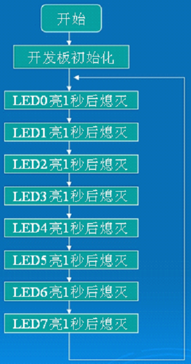
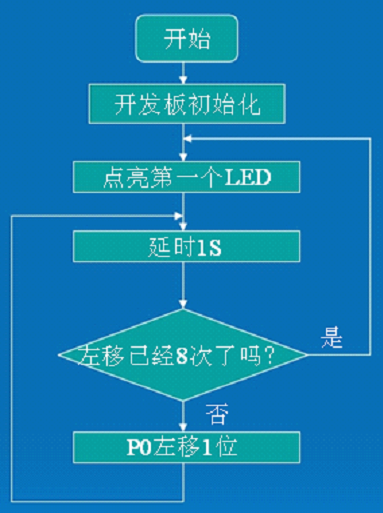
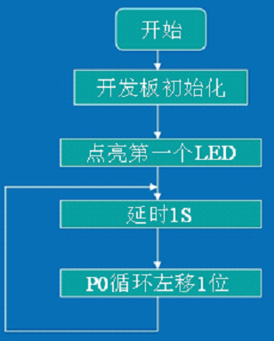
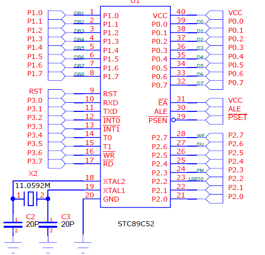
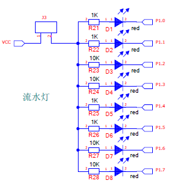

# 流水灯设计
## 本讲任务：
分别用位 __输出操作、移位操作、循环移位__ 操作完成3个典型流水灯的设计。  

掌握下列C语言知识点：
- 宏定义、函数和函数调用、循环结构、while语句、关系运算和逻辑值
- 掌握流程图绘制。
- 完成闪烁灯的设计。
- 如 何 完 成 函 数 调 用。

## 完成一个典型流水灯的设计
程序就是人的思想的反映，编程最重要的就是你的编程思路，有什么样的思路就会编出什么样的程序。  

先看上一讲的点一个发光管程序：  
 1、思路分析。流程图是整理我们思路的好工具，同时也能保证若干年以后你还能轻易看懂自己编写的程序。  
 2、程序讲解（这个程序是利用了位输出操作） 。
 - 宏定义
 - 函数和函数调用
 - 如何熄灭发光管
 - 循环结构，while语句详解、关系运算和逻辑值
 - 如何改变流水灯流动的速度

本讲需要学习的新知识  
- 数电、模电方面同上一讲一样，有不熟悉的同学也可回看上一讲的内容，本讲在C语言方面增加了一个新的函数。  
- 延时函数delay
- for循环语句

### 了解一下延时函数

学过汇编你就会知道，每条指令都占一定的时间（或者机器周期）的，如果你让机器什么都不做，即空指令的话，机器就会延时，然后你在计算好每次延时到底有多长，外面套一个循环（或者多重循环），根据你想要的延时时间
即可计算出来循环的次数 ，延时函数基本上都是这种原理，它的参数就是用来控制循环次数的。

### 怎样编写精确的延时函数？
实现延时通常有两种方法：  

一种是硬件延时，要用到定时器/计数器，这种方法可以提高CPU的工作效率，也能做到精确延时；  
- 使用定时器/计数器实现精确延时  

另一种是软件延时，这种方法主要采用循环体进行。

- 软件延时与时间计算
 在很多情况下，定时器/计数器经常被用作其他用途，这时候就只能用软件方法延时。下面介绍几种软件延时的方法。
    - 2.1 短暂延时
    - 2.2 在C51中嵌套汇编程序段实现延时
    - 2.3 使用示波器确定延时时间
    - 2.4 使用反汇编工具计算延时时间

### 认识一个For 循环语句
• For (表达式1;表达式2;表达式3)  { 语句（内部可为空）}  
执行过程：
1. 求解一次表达式1.
2. 求解表达式2，若其值为真（非0 即为真），则执行for中语句。然后执行第3步。否则结束for 语句，直接跳出，不再执行第3步。
3. 求解表达式3.
4. 跳到第2步重复执行  

### 一个简单的延时函数
只需要了解一下，不需要记住，学会调用它就可以了。
```
 /*------------------------------------------------
 延时函数，含有输入参数 unsigned int t，无返回值
 unsigned int 是定义无符号整形变量，其值的范围是0~65535
 ------------------------------------------------*/
  void Delay(unsigned int t)
  {
  while(--t);
  }
 ```
### 了解一下实验板初始化
初始化就是把变量赋为默认值，把控件设为默认状态，把没准备的准备好。   

但是如果是整个系统初始化那就不一样了。在汇编语言中，为变量分配空间时，初始化过的变量的初值位于可执行文件代码段数据后，会占用一定空间，不必要的初始化会造成磁盘空间的浪费。  

在C语言等高级语言中，为每一个变量赋初值被视为良好的编程习惯，有助于减少出现Bugs的可能性。因此，是否对不必要的变量初始化依情况而定。

### 宏定义
#号是预处理指令，用#开头。
#define ON （新的名称 ） 1（原来的名称）  
- 作用：在程序书写时可用新的名称代替原来的名称书写，以达到简化或直观的效果。编译器在预处理的时候，自动将新的名称还原为原来的名称。  
- 书写位置：源程序开头，函数的外面
### 3个流水灯程序框图


### 函数的引入
函数是C语言的主要特点，也是我们学习的一个重点。  
主函数：主人，只有一个。
在实际编程中，我们会遇到两种情况：  
1. 需要使用别人的程序，现在是网络共享时代，要学会在网络中找到你需要的东西，例如 DS18B20功能函数
2. 某一段程序会反复用到，这时，我们需要用到函数和函数调用其他功能函数：工人（下属，可以被调用完成某项工作的人），以有多个，可实现某种功能的一段相对独立的，可以被调用的代码 。

__注意：我们一般所说函数，指的都是功能函数__

#### 实现函数调用的前提：调用者必须能看到被调用者

调用者必须能看到被调用者程序如何才能找到要调用的函数呢？
有三种方法：
- 第一种、将被调用函数写在当前代码之前。
- 第二种、将被调用函数的函数声明写在当前代码之前。
- 第三种：使用头文件 。

#### 如何完成函数的调用
 函数调用：就是在一个函数体中引用另外一个已经定义的函数  
 完成函数的调用三种方式：  
 1. 函数语句。函数名（实际参数表）；有参调用和无参调用
 2. 函数表达式。
 3. 函数参数。  
 函数的调用注意掌握4个要点：被调函数名称、功能、参数、返回值。函数内部语句不必了解！
### While循环语句
```
While （关系表达式或逻辑值）;
While （关系表达式或逻辑值）一条语句；
While （关系表达式或逻辑值） 注意：这里没有分号
 {
 语句1;
 语句2;
 语句3;
 语句n;
}
```
特点：先判断条件表达式，后执行语句。
 原则：若条件表达式的值为真，那么执行语句。否则跳出
while 语句。
### 关系运算和逻辑值

关系运算1<3=1 1==2=0 1+1>2=0
逻辑值：真（1或非0），假（0）
计算机中三种运算千万不要搞混了：
1. 算术运算：参与运算的对象是数，结果也是数，运算符是加减乘
除；
2. 逻辑运算：参与运算的对象是逻辑量，结果也是逻辑量，运算符
是与或非；
3. 关系运算：参与运算的对象是数，结果是逻辑量，运算符如下：> < >= <= ==等于（注意：与赋值符=，完全不同！） != 不等于
### 如何改变流水灯流动的速度
1. 改变调用延时函数的实参。
2. 更换不同频率的晶振。（复习以前讲过的时钟的快慢决定了程序运行速度）
### 左移和右移
位运算：按位对变量进行运算。  
左移和右移属于位运算。  
格式：  
```
P1<<1;/*左移一位*/ 
a>>2;/*右移二位*/
```
一般我们比较多的是对8位无符号数进行移位操作，移出的数丢弃，空位自动补0。  
注意点：_位运算不改变参与运算的变量的值，如果希望改变参与运算的变量的值，应利用相应的赋值操作！_  
__用左移编写第二个流水灯程序。__

### 循环左移和循环右移
C51没有专门的循环左移和循环右移指令，但我们可以调用C51库函数实现循环左移和循环右移
#### 必须先包含intrins.h
```
#include<intrins.h>
i=_crol_(i,1);/*将i循环左移1位*/
i=_cror_(i,1);/*将i循环右移1位*/  
```
__用循环左移编写第三个流水灯程序。__

### 流水灯电路原理图
  
  
