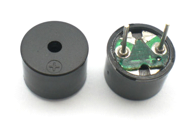
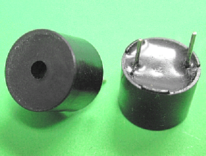

# 蜂鸣器的发声
## 本讲任务
1. 如何驱动蜂鸣器发声
2. 简单蜂鸣器发声实验
3. 给上节课的流水灯加入报警效果
4. 蜂鸣器演奏音乐(介绍)

## 蜂鸣器

在图片上认识蜂鸣器：有绿色电路板的一种是无源蜂鸣器，没有电路板而用黑胶封闭的一种是有源蜂鸣器.

蜂鸣器是一种一体化结构的电子讯响器，采用直流电压供电，广泛应用于计算机、打印机、复印机、报警器、电子玩具、汽车电子设备、电话机、定时器等电子产品中作发声器件。蜂鸣器主要分为压电式蜂鸣器和电磁式蜂鸣器两种类型。  

蜂鸣器在电路中用字母“H”或“HA”（旧标准用“FM”、“LB”、“JD”等）表示。

有源蜂鸣器和无源蜂鸣器：判断有源蜂鸣器和无源蜂鸣器，还可以用万用表电阻档Rxl档测试:用黑表笔接蜂鸣器"+"引脚，红表笔在另一引脚上来回碰触，如果触发出咔、咔声的且电阻只有8Ω(或16Ω)的是无源蜂 蜂鸣器,如果能发出持续声音的，且电阻在几百欧以上的，是有源蜂鸣器。
## 有源蜂鸣器和无源蜂鸣器

这里的“源”不是指电源。而是指震荡源。   
也就是说有源蜂鸣器内部带震荡源，所以只要一通电就会叫。   
而无源内部不带震荡源，所以如果用直流信号无法令其鸣叫,必须用2K~5K的方波去驱动它。  
有源蜂鸣器往往比无源的贵，就是因为里面多个震荡电路。  
无源蜂鸣器的优点是：
1. 便宜 
2. 声音频率可控，可以做出“多来米发索拉西”的效果。
3. 在一些特例中，可以和LED复用一个控制口  

有源蜂鸣器的优点是：
- 程序控制方便 。 

## 蜂鸣器驱动电路

由于蜂鸣器的工作电流一般比较大，以致于单片机的I/O 口是无法直接驱动的，所以要利用放大电路来驱动，一般使用三极管来放大电流就可以了

## 蜂鸣器软件设计方法
- 软件设计方法
- IO口电平取反方法：I/O 口的电平进行翻转一次，直到蜂鸣器不需要鸣叫的时候，将I/O 口的电平设置为高电平即可。
