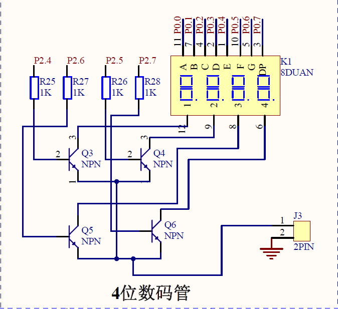

# 数码管静态显示

##  本讲任务
如何在4位数码管进行数字和字母的显示
## 共阴数码管字形码表(常用)
```
0x3f , 0x06 , 0x5b , 0x4f , 0x66 , 0x6d ,
0      1       2      3      4       5
0x7d , 0x07 , 0x7f , 0x6f , 0x77 , 0x7c ,
6       7      8      9      A      B
0x39 , 0x5e , 0x79 , 0x71 , 0x00
C       D      E      F     不显示
```
## 显示器及其接口
单片机系统中常用的显示器有：
- 发光二极管LED(Light Emitting Diode)显示器
- 液晶LCD(Liquid Crystal Display)显示器、CRT显示器等。  

LED、LCD显示器有两种显示结构：
- 段显示（7段、米字型等）
- 点阵显示（5×8、8×8点阵等）。
## 数码管可显示内容和特点
可显示内容：  
数字、小数点和部分英文 字符、符号。  
特点：
1. 自发光、亮度高，特别适合环境亮度低的场合使用。
2. 牢固，不怕冲击。数码管是一种半导体发光器件，其基本单元是发光二极管。
## 数码管实物
  


## LED显示器（数码管）的结构与原理
### 数码管的结构
LED显示器(数码管)系发光器件的一种。常用的LED发光器件有两类：数码管和点阵。
数码管内部由七个条形发光二极管和一个小圆点发光二极管组成，根据各管的亮暗组合成字符。根据内部发光二极管的接线形式可分为共阴极和共阳极两种。  
使用时，共阴极数码管公共端接地，共阳极数码管公共端接电源。每段发光二极管需5～10mA的驱动电流才能正常发光，一般需加限流电阻控制电流的大小。
### 数码管显示原理
LED数码管的a～g七个发光二极管。加正电压的发光，加零电压的不能发光，不同亮暗的组合就能形成不同的字型，这种组合称为字型码。  
共阳极和共阴极的字型码是不同的，下面我们分析一下
#### LED显示二种接法
  
使用LED显示器时，要注意区分这两种不同的接法。为了显示数字或字符，必须对数字或字符进行编码。七段数码管加上一个小数点，共计8段。因此为LED显示器提供的编码正好是一个字节。  
BST实验板用共阴LED显示器。
#### LED数码管显示分析
_LED数码管的结构：①共阳与共阴_  
  
单片机系统扩展LED数码管时多用共阳LED:
共阳数码管每个段笔画是用低电平(“0”)点亮的,要求驱动功率很
小；而共阴数码管段笔画是用高电平(“1”)点亮的，要求驱动功率较
大。
通常每个段笔画要串一个数百欧姆的降压电阻。

### 静态显示驱动
静态驱动也称直流驱动。静态驱动是指每个数码管的每一个段码都由一个单片机的I/O端口进行驱动，或者使用如BCD码二-十进制译码器译码进行驱动。  
静态驱动的优点是编程简单，显示亮度高，缺点是占用I/O端口多，如驱动5个数码管静态显示则需要5×8=40根I/O端口来驱动，要知道一个89S52单片机可用的I/O端口才32个呢：），实际应用时必须增加译码驱动器进行驱动，增加了硬件电路的复杂性

### 数码管驱动电路
  
要驱动1个四位数码管常见的有以下几种数码管驱动电路：  
1. 使用12个IO口
2. P2.4-P2.7驱动位选，IO口直接驱动位选
3. P0驱动段选，IO口直接驱动段选


