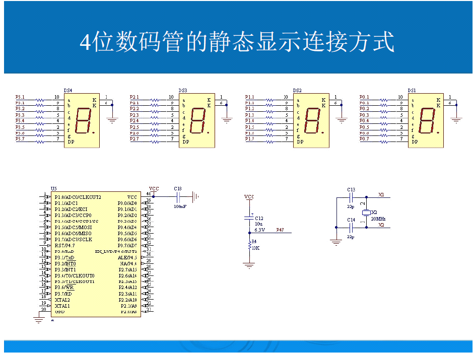
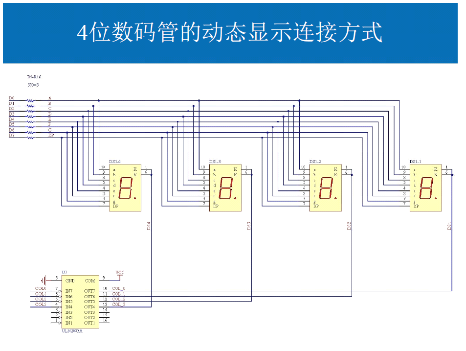

# 数码管动态显示
## 本讲任务：
    了解数码管动态显示原理，掌握其编程方法。

穿插讲解以下知识点：  
- 数组、元素、利用数组实现查表  ，局部变量和全局变量的作用域、可见性
## 从1位数码管说起

### 复习：_1位数码管和单片机的连接，其上显示1位十进制数的方法。_  

问题的提出：  
1. 如何显示4位十进制数？  
- 用4个1位数码管拼成。  
2. 8个1位数码管和单片机如何连接  
- a. 静态显示的连接方式、静态显示的优缺点（优点：不需要动态刷新；缺点：占用IO口线多）。
- b. 动态显示的连接方式（所有位数码管的段选线并联在一起，由 位选线控制是哪一位数码管有效）、动态显示的优缺点（缺点：需要动态刷新；优点：占用IO口线少）。

4位及4位以上比较适合用动态显示，为了方便使用，市售的4位一体数码管，内部已经按动态显示的连接方式连好了。

## 动态扫描的原理
在实际的单片机系统中，往往需要多位显示。动态显示是一种最常见的多位显示方法，应用非常广泛。所有数码管段选都连接在一起的时候，怎么让数码管显示不一样的数字呢？  

动态显示是多个数码管，交替显示，利用人的视觉暂停作用使人看到多个数码管同时显示的效果。就像我们看的电影是有一帧一帧的画面显示的，当速度够快的时候我们看到它就是动态的。  

__当我们显示数码管的速度够快的时候，也就可以看到它们是同时显示了。__

  

  
## 动态显示编程原理
先编写一个程序，在4位一体数码管左数第4位显示4，过1秒，在左数第3位显示3，过1秒，在左数第2位显示2，过1秒，在左数第1位显示1,上述过程不断循环。  

将中间的延时时间不断改短，我们发现了什么？  

__刷新频率>50HZ,我们就感觉不到闪烁了。__  

所谓动态扫描显示是指轮流向各位数码管送出段选（字形码）和位选，由于人眼的视觉残留作用，使人的感觉好像各位数码管同时都在显示。
动态显示的亮度比静态显示要低，所以在选择限流电阻时应小于静态显示电路中的。

## 变量的作用域
变量有名称（姓名）、储存单元地址（肉身），还有作用范围、也叫有效范围（活动范围）、生命期（寿命）。变量的作用域是指变量的“有效范围”，具体是指是可以使用变量名的程序代码区域 。  

在变量的作用域中，可以合法地引用它、设置它的值。在变量的作用域之外，就不能使用它了，如果非要那么做，将会导致编译错误。变量，有的可以在整个程序中的所有范围内起作用，这称为全局变量。而有的只能在一定的范围内起作用，称为局部变量。
## 局部变量和全局变量
```
局部变量：
一对{ }括起来的代码范围，属于一个局部作用域。在局部作用域内定义的变量，称为“局部变量”，也称为内部变量。
局部作用域可以是一个函数体，也可以是复合语句。
在局部作用域内定义的变量，其有效范围从它定义的行开始，一直到该局部作用域结束。 离开该该局部作用域后再使用这种变量是非法的。

定义方法：
1、 {
数据类型 变量名；
……
2、 {
数据类型 变量名=初值；
……

全局变量：
在所有函数外部定义的变量具有全局作用域，即该变量在整个工程的所有文件中都是有效的. 全局变量也称为外部变量。
它不属于哪一个函数，它属于一个工程。其作用域是整个工程。
定义方法：
1、 数据类型 变量名；
……
2、 数据类型 变量名=初值；
……
```
## 变量的可见性
和函数一样，要使用变量，朝前看，必须要能看到变量的定义。  

说得再简洁些，就是：看到变量，你就能使用这个变量。看不到变量，你就不能使用这个变量。  

先讨论局部变量：  
作用域内肯定能看到，作用域外肯定看不到，作用域=可见性，局部变量在定义的同时就声明了，所以局部变量一般不严格区分变量的定义和声明。  

再讨论全局变量：   
作用域：整个工程；可见性：从它定义或声明的行开始，一直到源文件的结束作用域和可见性可能一样，也可能不一样。作用域内不一定可见。  

看见全局变量的3种方式（和看见函数的3种方式完全一致）：  
第一种、将全局变量的定义写在使用全局变量的语句的前面。----看到本人。  

第二种、将全局变量的声明写在使用全局变量的语句的前面。----全局变量的  声明就是全局变量的名片，看不到本人，看到他的名片也可以。extern <类型名> <变量名>;

第三种：使用头文件 。

_全局变量只能在定义的时候初始化. 在声明的时候不允许初始化_  
__全局变量一次定义，但可以多次声明。  __  

## 问题：C语言中允许同名变量存在吗？
如果回答不允许，那是错的！  
正确答案：  
1. 在不同的作用范围内，允许同名局部变量存在！虽然变量名相同，但它们是完全不同的变量，之间没有任何关系。你对一个局部变量赋值，不会影响到其他作用域中的同名局部变量。

2. 在相同的作用范围内，不允许同名局部变量存在！

3. 不允许同名全局变量存在！
## 关于变量定义的一些建议

全局变量主要用于函数间数据传送，从模块化编程的要求看，函数间数据传送一般要使用形参/实参、返回值来传送，除非万不得已，一般不要用全局变量来传递，总之，要严格控制全局变量的使用，用得越少越好！  

一般我们定义变量的时候，没有特殊情况，全部定义为局部变量，使用局部变量的好处：
1. 不用考虑本作用域外是否有同名变量。
2. 节约RAM空间。
3. 便于移植。
## 定义一个简单的数据类型
整型无符号 uint 范围 0-65535 16位
```
#define uint unsigned int
```
字符型无符号 uchar 范围 0-255 8位
```
#define uchar unsigned char
```
只要定义上面的数据类型后，写程序会简单很多
## 数组
数组：同类型的一批数据的有序集合。由若干个元素组成。必须先定义，后使用！  
数组的定义：  
  [存储器类型] 数据类型 数组名[元素的个数];  
赋初值：  
  - 定义的同时 可以对 整个数组 赋初值初值的个数不能超过数组的大小
  - 可以不指定元素的个数，则初值的个数就是元素的个数
  - 定义以后 只能对 单个元素 进行赋值  

元素的引用:
  - 用数组名和下标确定。
  - 强调：下标从0开始。定义数组 uchar sz[10]；得到的是sz[0] ~sz[9]这10个元素，sz[10]是不存在的！  
## 0-F共阴字形码表

```
0x3f , 0x06 , 0x5b , 0x4f , 0x66 , 0x6d ,
0        1      2      3      4       5
0x7d , 0x07 , 0x7f , 0x6f , 0x77 , 0x7c ,
6       7       8     9      A       B
0x39 , 0x5e , 0x79 , 0x71 , 0x00
C       D      E      F     不显示

• uchar code sz[17]={0x3f , 0x06 , 0x5b ,0x4f , 0x66 , 0x6d ,0x7d ,                0x07 , 0x7f , 0x6f ,0x77 , 0x7c , 0x39 , 0x5e , 0x79 , 0x71 , 0x00};

```

