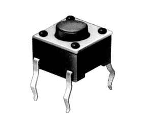
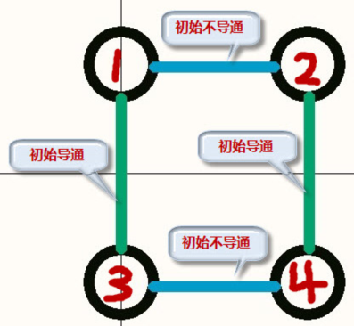
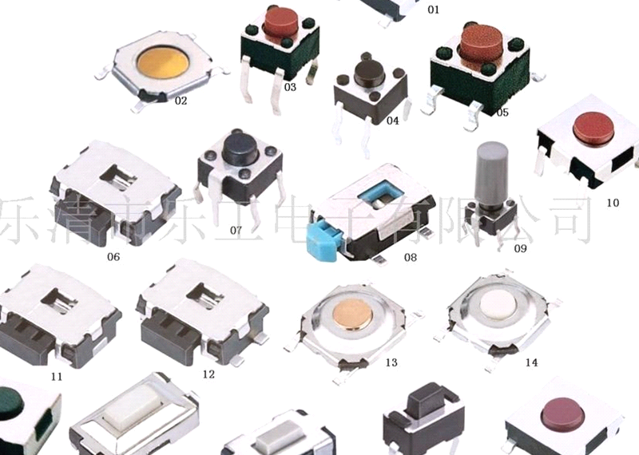
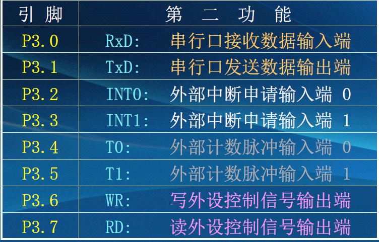
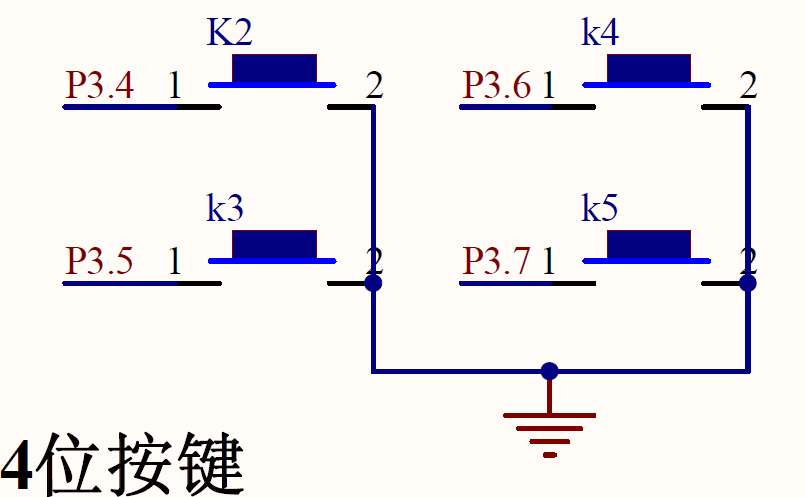
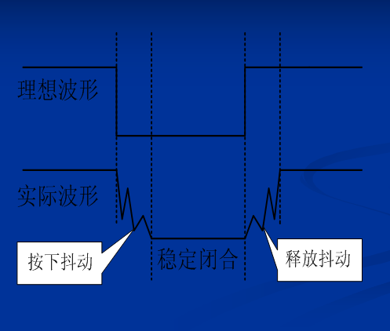
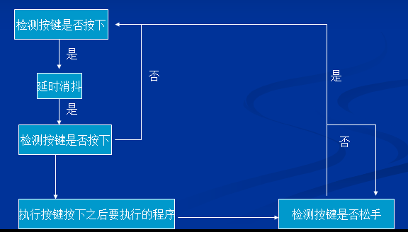
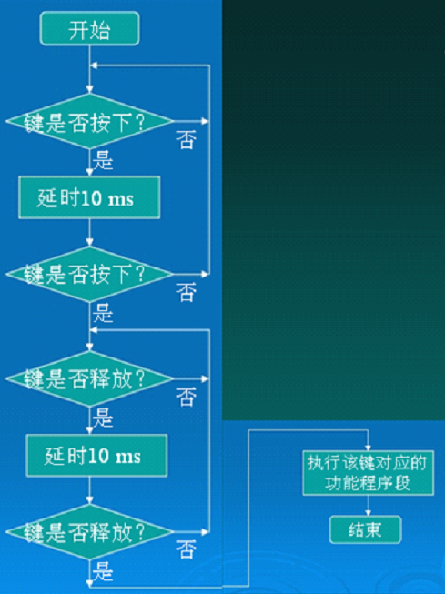

# 独立键盘输入
## 本讲任务：
- 如何检测键盘输入
- 复习一下P3引脚
## 认识一下各种按键
  
## P3口第二功能表
___注:P3.4~P3.7对应按键监听位___    
  
P3.0—P3.7: 双功能口（内置了上拉电阻）  
__它具有特定的第二功能。__  
_在不使用它的第二功能时它就是普通的通用准双向I/O口。_

## 如何检测键盘输入
键盘的分类  
_独立式键盘电路原理。_  
编写一个简单的键盘输入程序： 按下KEY1，用LED显示出信号  。

读端口就是读Pn端口寄存器；读引脚就是读该引脚在Pn端口寄存器中的对应位，通过引用Pn端口寄存器的值，或者引用Pn端口寄存器中的对应位，就可以实现读端口或者读引脚。  

IF语句:  
- 键盘输入检测的一种基本方法：轮询法。  
    - 键按下和释放时，输入信号的抖动现象，如何进行键盘软件消抖。

## 键盘的分类
键盘分编码键盘和非编码键盘。键盘上闭合键的识别由专用的硬件编码器实现，并产生键编码号或键值的称为编码键盘，如计算机键盘.  
而靠软件编程来识别的称为非编码键盘；__在单片机组成的各种系统中，用的最多的是非编码键盘。__
也有用到编码键盘的。  
非编码键盘又分为：
- 独立键盘
- 行列式（又称为矩阵式）键盘。
## IF语句（条件分支语句 ）
```
if (条件) 语句
     语句可以是复合语句
     复合语句：用 { }将多条语句组合在一起而形成的一种语句不需要用；结束，但它内部的语句仍需要用；结束。
复合语句格式：
{
局部变量定义；
语句1；
语句2；
……
语句n；
}
```
## BST-M51独立按键
  
## 键盘软件消抖
按键一般是利用机械触点的闭合、断开作用，由于机械触点的弹性作用，在其闭合、断开瞬间均有抖动过程，抖动时间一般在5—10mS，稳定闭合时间由操作人员的按键动作决定，一般为零点几秒到几秒。  
为了保证单片机对一次闭合，仅作一次键输入操作，必须在编程时候编写必要的程序代码来去除抖动影响，称键盘软件消抖。
## 判断键一次按下的具体方法
先判断键是否按下，若按下了延时10 ms，跳过按下抖动期，然后再判断按键是否按下，若是说
明按键真的按下了，否则说明是干扰信号，如果键真的按下了，则等待键释放.  
如果键释放了，延时10 ms，再判断键是否释放，若释放了，说明按键真的释放了，否则说明是干扰信号，如果按键真的释放了，说明一次完整的按键过程完成了。在一次完整的按键后，可以连接该键对应的功能程序段，以实现特定的功能。
### 按键在闭合和断开时，触点会存在抖动现象：
 
## 程序思路
  
