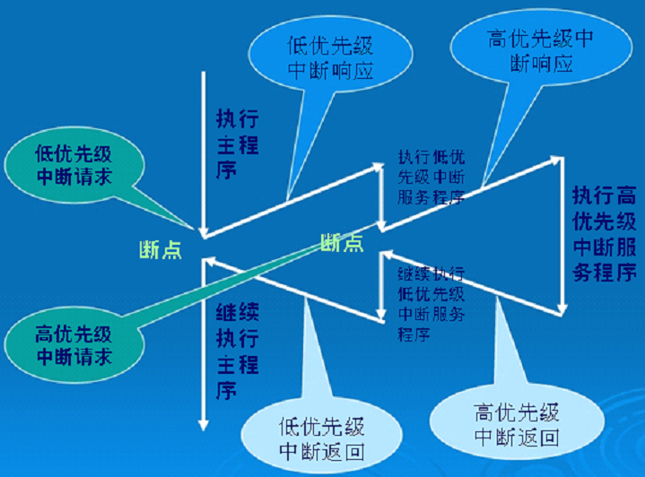

# 第9讲 单片机中断系统
## 单片机中断系统
### 本讲任务：
了解中断概念，以INT外部中断为例详细讲解中断程序的编写方法。
## 引言
单片机中的中断系统是解决突发事件和多任务实时处理的最佳方法，熟练掌握中断技术的应用是一个合格电子工程师必备的能力。

_这一章比较难，因为涉及到很多概念以及需要理解，但我们在微机原理学了一点关于8086的中断系统，应该能够很好的理解 _   
在8086中标志寄存器有一个中断允许标志位(IF),也分成了非屏蔽中断和可屏蔽中断，在引脚NMI(non maskable interrupt) 和INTR上。  
非屏蔽中断：NMI的信号一旦出现，CPU必须响应，用来处理紧急状态，优先级最高。  
可屏蔽中断: 受IF的限制，监听的是INTR引脚用来产生中断。  


## 为什么要引入中断原因
 - 一个高速主机和一个低速外设连接时，效率极低，低速外设工作时无端占用大量CPU时间。  
 - 一个高速主机和多个低速外设连接时，高速主机无法进行多任务并行处理。
## 中断概念的引出
1. 生活中的中断法例子。
2. 中断的概念：  
    - CPU在处理某一事件A时，发生了另一事件B的请求（中断请求）；
    - CPU暂时中断当前的工作，转去处理事件B（中断响应和中断服务）；
    - 待CPU将事件B处理完毕后，再回到原来事件A被中断的地方继续处理事件A（中断返回），这一过程称为中断 。

## 中断源
引起CPU中断的根源，称为中断源。中断源向CPU提出的中断请求。  
CPU暂时中断原来的事务A，转去处理事件B。对事件B处理完毕后，再回到原来被中断的地方（即断点），称为中断返回。  
实现上述中断功能的部件称为中断系统（中断机构）。
## 中断的优点
早期的计算机系统是不包含中断系统的。  
后来为了解决快速主机与慢速外设的数据传送问题，引入了中断系统.  
它的优点：
1. 分时操作。CPU可以分时为多个外设服务，提高了计算机的利用率；
2. 实时响应。CPU能够及时处理应用系统的随机事件，系统的实时性大大增强；
3. 可靠性高。CPU具有处理设备故障及掉电等突发性事件能力，从而使系统可靠性提高。
## 中断传送方式特点
数据传送的双方平时各自做自己的工作，一旦甲方要求与乙方进行数据传送，就主动发出信号提出申请，乙方接到申请后若同意传送，安排好当前的工作，再响应与甲方发生数据传送。  
完事后，回去继续做打断前的工作。  
__中断功能强弱是计算机性能优劣的重要标志.__
- 提高CPU效率 解决速度矛盾
- 实现并行工作 应付突发事件……
## 中断涉及的几个环节
中断涉及的几个环节
1. 中断源           （前面提到的甲方）
2. 中断申请       （甲方发出信号提出申请）
3. 开放中断       （乙方同意传送）
4. 保护现场       （安排好当前的工作）
5. 中断服务       （响应乙方的要求）
6. 恢复现场       （完事后，回去……）
7. 中断返回       （继续做打断前的工作）


## 80C51中断系统的结构
80C51的中断系统有5个中断源（8052有 6个） ，2个优先级，可实现二级中断嵌套 。  
1. (P3.2）可由IT0(TCON.0)选择其为低电平有效还是下降沿有效。当CPU检测到P3.2引脚上出现有效的中断信号时，中断标志IE0(TCON.1)置1，向CPU申请中断。  
2. (P3.3）可由IT1(TCON.2)选择其为低电平有效还是下降沿有效。当CPU检测到P3.3引脚上出现有效的中断信号时，中断标志IE1(TCON.3置1,向CPU申请中断。
3. TF0（TCON.5），片内定时/计数器T0溢出中断请求标志。当定时/计数器T0发生溢出时，置位TF0，并向CPU申请中断。
4. TF1（TCON.7），片内定时/计数器T1溢出中断请求标志。当定时/计数器T1发生溢出时，置位TF1，并向CPU申请中断。
5. RI（SCON.0）或TI（SCON.1），串行口中断请求标志。当串行口接收完一帧串行数据时置位RI或当串行口发送完一帧串行数据时置位TI，向CPU申请中断。

## 中断允许控制
CPU对中断系统所有中断以及某个中断源的开放和屏蔽是由中断允许寄存器IE控制的。
  
- EX0(IE.0)，外部中断0允许位；
- ET0(IE.1)，定时/计数器T0中断允许位；
- EX1(IE.2)，外部中断0允许位；
- ET1(IE.3)，定时/计数器T1中断允许位；
- ES（IE.4)，串行口中断允许位；
- EA (IE.7)， CPU中断允许（总允许）位。

## 定时器/计数器控制寄存器TCON
  
- IT0和IT1是设置外部中断的触发方式。
    - 当其为0时，为低电平触发方式
    - 当其为1时，为负跳变触发方式。
- IE0和IE1是外部中断标志位 其他的是定时/计数器的控制。
    - TF0和TF1是定时器的中断标志。
    - TR1和TR0是打开相应的定时器
## 中断优先级控制
80C51单片机有两个中断优先级，即可实现二级中断服务嵌套。每个中断源的中断优先级都是由中断优先级寄存器IP中的相应位的状态来规定的 。  
   
- PX0（IP.0），外部中断0优先级设定位；
- PT0（IP.1），定时/计数器T0优先级设定位；
- PX1（IP.2），外部中断1优先级设定位；
- PT1（IP.3），定时/计数器T1优先级设定位；
- PS （IP.4），串行口优先级设定位；
- PT2 (IP.5) ，定时/计数器T2优先级设定位。

同一优先级中的中断申请不止一个时，则有中断优先权排队问题。同一优先级的中断优先权排队，由中断系统硬件确定的自然优先级形成，其排列如所示：
  
设置52单片机的4个中断源,使他们的优顺序为  
```
T1,INT1,INT0,T0.
IPH = 0X08; PT1 = 1;
IP = 0X40; PX1 = 1;
```

### 80C51单片机的中断优先级有三条原则：
_CPU同时接收到几个中断时，首先响应优先级别最高的中断请求。_  
- 正在进行的中断过程不能被新的同级或低优先级的中断请求所中断。
- 正在进行的低优先级中断服务，能被高优先级中断请求所中断。  

__为了实现上述后两条原则，中断系统内部设有__  
- 两个用户不能寻址的优先级状态触发器。
- 其中一个置1，表示正在响应高优先级的中断，它将阻断后来所有的中断请求；
- 另一个置1，表示正在响应低优先级中断，它将阻断后来所有的低优先级中断请求。
## 80C51单片机中断处理过程
中断响应条件  
- 中断源有中断请求；
- 此中断源的中断允许位为1；
- CPU开中断（即EA=1）。  

___以上三条同时满足时，CPU才有可能响应中断。___

### 中断源：  
_8051的中断系统有5个中断源 ，2个优先级。STC12C5A60S2的中断系统有10个中断源，2个优先
级或4个优先级。可实现二级或四级中断服务嵌套。_
## 一次中断过程的完整步骤
1. 中断请求：中断事件一旦发生，中断源就提交中断请求（将中断
标志位置1），欲请求CPU暂时放下目前的工作转向为该中断作专项
服务。
2. 中断使能：虽然中断源提交了中断请求，但是，能否得到CPU的
响应，还要取决于该中断请求能否通过若干关卡送达CPU（中断使能
位等于1，关卡放行），这些关卡有以下两类：
此中断源的中断允许位；
全局中断允许位。
3. 中断响应：如果一路放行，则CPU响应该中断请求，记录断点，
跳转到中断服务程序。对于INT和TMR中断，中断响应时中断标志位
会被硬件自动清零。
4. 中断处理：对中断源进行有针对性的服务。
5. 中断返回：返回到主程序断点处，继续执行主程序。  

___1、3、5由硬件自动完成。2、4是用户编程完成。中断响应条件为1、2同时满足。___
## 中断请求标记的置位和清除
1. 外部中断:  
    - 下降沿触发方式条件下，在产生中断请求时由硬件置位（置1）中断请求标记，当CPU响应中断时由硬件清除（清0 ）。电平触发方式条件下，中断请求标记由外部中断源控制。具体是：当CPU检测到INT引脚上出现低电平时，中断标志IE由硬件置位，INT引脚上出现高电平时，中断标志IE由硬件清除。
2. 定时器中断:  
    - 计数溢出时由硬件置位中断请求标记，当CPU响应中断由硬件清除。
3. 串口中断:  
    - 当串行口接收完一帧数据后请求中断，由硬件置位中断请求标记RI，RI必须由软件清除。当串行口发送完一帧数据后请求中断，由硬件置位中断请求标记TI，TI必须由软件清除。
## 每个中断源的3个位
- 优先级定义位：每个中断源可以选择中断优先权
（Priority二选一或四选一）
- 中断使能位：每个中断源均可使能（Enable）或使不能(Disable)
- 中断请求标记位：每个中断源均有独立的中断请求标记（Flag）
- 中断请求标记的产生：中断事件发生时，由硬件自动产生
- 中断请求标记的清除：中断事件被响应时，由硬件自动清除


## 全局中断使能位
EA ：全局中断使能位（总允许位）。
=0：全局中断禁止；=1：全局中断允许。
## 中断服务函数
```
中断函数的写法
void 函数名() interrupt 中断编号	 
{
	；	
}

```
  
## 中断的优先级
如果多个中断源同时提出了中断请求，怎么办？  
__先响应高优先级中断源，后响应低优先级中断源。__  

属于相同优先级的中断源，则根据其内部中断查询顺序，先查询的先响应，后查询的后响应。注意：这个查询是硬件自动帮我们完成的，程序员并不需要为此书写语句。  

Q:如果一个中断源提出了中断请求，已经转去执行其中断服务程序了，期间又有一个中断源提出了中断请求，CPU会如何处理？  
答:
_如果新的中断优先级与当前正在处理的中断是同级的，则不予响应，待当前中断服务d程序执行完毕后，再响应。如果新的中断优先级比当前正在处理的中断高的，则会发生中断嵌套。_

结论：优先级是程序员指定的。在多中断源程序的编写中，程序员必须认真考虑优先级问题，否则中断系统会运行不正常，甚至导致危险的发生。
## 中断的嵌套
  
中断优先级的三条原则：
- CPU同时接收到几个中断时，首先响应优先级别最高的中断请求。
- 正在进行的中断过程不能被新的同级或低优先级的中断请求所中断。
- 正在进行的低优先级中断服务，能被高优先级中断请求所中断。
